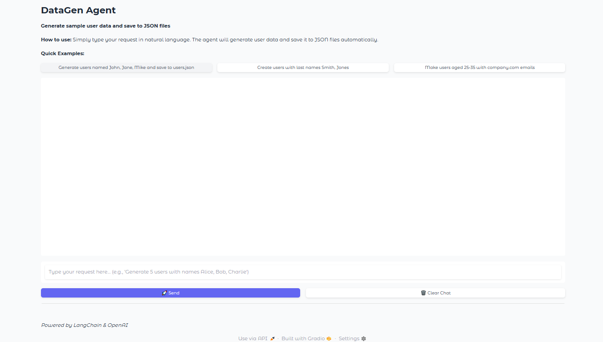

DataGen Agent

This is a Gradio-based application for generating sample user data using LangChain and OpenAI.

Features:

- Generate sample users with names, ages, and email domains
- Save generated data to JSON files
- Interactive chat interface

Installation:

1. Clone the repository
2. Install dependencies: pip install -r requirements.txt
3. Set up your OpenAI API key in a .env file: OPENAI_API_KEY=your_key_here
4. Run the app: python main.py

Deployment with Docker:

1. Build the image: docker build -t datagen-app .
2. Run the container: docker run -p 7860:7860 -e OPENAI_API_KEY=your_key datagen-app

Or use Docker Compose:

1. Run: docker-compose up

The app will be available at http://localhost:7860
